<p align="center">
  
</p>

<h1 align="center">🌱 FarmInsight</h1>

<p align="center">
  <strong>Smart Monitoring Platform for Food Production Facilities</strong>
</p>

<p align="center">
  <a href="https://farminsight.etce-lab.de">
    
  </a>
</p>

<p align="center">
  
  
  
  
  
</p>

<p align="center">
  
  
</p>

---

## 📋 Table of Contents

- [About](#-about)
- [Features](#-features)
- [Architecture](#-architecture)
- [Repository Structure](#-repository-structure)
- [Quick Start](#-quick-start)
- [Technology Stack](#-technology-stack)
- [Feature Showcase](#-feature-showcase)
- [Contributing](#-contributing)
- [Contributors](#-contributors)
- [License](#-license)

---

## 🎯 About

**FarmInsight** is a comprehensive open-source platform for monitoring and managing Food Production Facilities (FPFs). Developed at TU Clausthal as part of the Digital Technologies program, it provides real-time sensor data visualization, AI-powered forecasting, and automated control systems.

<p align="center">
  
</p>

### 🌟 Core Vision

> **"Maximum yield with minimal sustainable resource input"**

FarmInsight enables organizations to manage multiple Food Production Facilities (FPFs) – from vertical farms to greenhouses – with precision and ease:

- **Monitor** – Real-time sensor data from temperature, humidity, soil moisture, and more
- **Analyze** – Interactive visualizations with historical trends and custom date ranges
- **Predict** – AI-powered forecasts for water and energy consumption
- **Automate** – Smart triggers and controllable actions for lights, pumps, and climate
- **Collaborate** – Multi-tenant architecture with role-based access (Admin/Member)

---

## ✨ Features

<table>
<tr>
<td width="50%">

### 🏢 Organization Management

- Multi-tenant architecture
- Role-based access (Admin/Member)
- Assign FPFs to organizations

### 📊 Sensor Integration

- HTTP & MQTT protocols
- Configurable polling intervals
- Real-time data streaming via WebSocket
- 10+ sensor models supported

### 📷 Camera Support

- Scheduled image capture
- RTSP/HTTP livestreaming
- Historical image gallery

</td>
<td width="50%">

### 🤖 AI-Powered Forecasting

- Water level predictions with irrigation optimization
- Energy consumption forecasts
- Best/Average/Worst-case scenarios
- Weather data integration (Open-Meteo)

### ⚡ Smart Automation

- Trigger-based actions (interval, time, sensor threshold)
- Hardware control via network (HTTP)
- Queue-based execution with hardware protection
- Manual override capability

### 🔔 Notifications

- Matrix server integration
- Configurable alerts per FPF
- Real-time status updates

</td>
</tr>
<tr>
<td width="50%">

### 💧 Water Management Dashboard

- Animated tank fill level visualization
- Field moisture monitoring
- AI-driven irrigation scheduling (Best/Average/Worst)
- Proactive refill recommendations

</td>
<td width="50%">

### ⚡ Energy Management Dashboard

- Battery State-of-Charge monitoring
- Solar production & grid power tracking
- Multi-scenario forecasts (Expected/Optimistic/Pessimistic)
- Automated grid connect/disconnect thresholds

</td>
</tr>
</table>

---

## 🏗 Architecture


### 🔄 Data Flow

```mermaid
sequenceDiagram
    participant S as 🌡️ Sensor
    participant FPF as 🌱 FPF Backend
    participant DB as ⚙️ Dashboard Backend
    participant AI as 🧠 AI Backend
    participant UI as 📱 Frontend
    participant U as 👤 User

    S->>FPF: Measurement (HTTP/MQTT)
    FPF->>DB: Store data (REST)
    DB->>DB: Save to InfluxDB
    
    loop Every Interval
        DB->>AI: Request Forecast
        AI->>AI: Run ML Model
        AI-->>DB: Predictions + Actions
    end
    
    U->>UI: Open Dashboard
    UI->>DB: Request Data (REST)
    DB-->>UI: Sensor Data + Forecasts
    UI-->>U: Visualize
    
    alt Trigger Activated
        DB->>DB: Execute Action
        DB->>S: Control Hardware
    end
```



---

## 📁 Repository Structure

```
FarmInsight/
├── 📱 dashboard-frontend/     # React Web Application
│   ├── smart_farm_frontend/   # Source code
│   └── .documentation/        # UI screenshots & guides
│
├── ⚙️ dashboard-backend/       # Central Django API
│   ├── django_server/         # Django project
│   ├── Dockerfile             # Container config
│   └── docker-compose.yml     # InfluxDB setup
│
├── 🌱 fpf-backend/             # Sensor Collection Service
│   ├── django_server/         # Django project
│   └── .documentation/        # Arduino/Pi Pico scripts
│
├── 🧠 ai-backend/              # ML Prediction Service
│   ├── model_service/         # Django ML project
│   ├── Dockerfile             # Container config
│   └── docs/                  # Model documentation
│
├── 📄 LICENSE                  # AGPL-3.0
└── 📖 README.md                # This file
```

---

## 🚀 Quick Start

### Prerequisites

| Component | Requirement |
|-----------|-------------|
| Node.js | v18+ LTS |
| Python | v3.11+ |
| pip | v24+ |
| Docker | Optional (for InfluxDB) |

### Development Setup

#### 1️⃣ Clone the Repository

```bash
git clone https://github.com/ETCE-LAB/FarmInsight.git
cd FarmInsight
git submodule init && git submodule update
```

#### 2️⃣ Start the Dashboard Backend

```bash
cd dashboard-backend/django_server

# Create virtual environment
python -m venv .venv
.venv\Scripts\activate  # Windows
# source .venv/bin/activate  # Linux/Mac

# Install dependencies
pip install -r requirements.txt

# Generate OIDC key
openssl genrsa -out rsa/oidc.key 4096

# Setup database
python manage.py migrate
python manage.py loaddata application

# Start server
python manage.py runserver 8000
```

#### 3️⃣ Start the Frontend

```bash
cd dashboard-frontend/smart_farm_frontend

# Install dependencies
npm install

# Configure backend URL
echo 'export const BACKEND_URL = "http://127.0.0.1:8000";' > src/env-config.ts

# Start development server
npm start
```

#### 4️⃣ (Optional) Start FPF Backend

```bash
cd fpf-backend/django_server
pip install -r requirements.txt
python manage.py migrate
python manage.py runserver 8001
```

#### 5️⃣ (Optional) Start AI Backend

```bash
cd ai-backend/model_service
pip install -r requirements.txt
python manage.py runserver 8002
```

> 📚 For detailed setup instructions, see the README in each component folder.

---

## 🛠 Technology Stack

<table>
<tr>
<th>Layer</th>
<th>Technologies</th>
</tr>
<tr>
<td><strong>Frontend</strong></td>
<td>


</td>
</tr>
<tr>
<td><strong>Backend</strong></td>
<td>


</td>
</tr>
<tr>
<td><strong>Database</strong></td>
<td>


</td>
</tr>
<tr>
<td><strong>AI/ML</strong></td>
<td>


</td>
</tr>
<tr>
<td><strong>IoT</strong></td>
<td>


</td>
</tr>
</table>

---

## 📸 Feature Showcase

Explore the FarmInsight platform through our modern, intuitive interface designed for efficient farm management.

---

### 🏠 Landing Page & FPF Overview

<p align="center">
  
  <br><br>
  <sub><i>Dashboard overview showing all Food Production Facilities with live camera previews and maintenance status indicators</i></sub>
</p>

<br>

The landing page provides instant visibility into all your FPFs:

- **Live Camera Previews** – Real-time thumbnails from each facility
- **Status Indicators** – Quick identification of facilities under maintenance
- **Organization Labels** – Easy filtering by organization (e.g., ETCE)
- **Search & Create** – Quickly find or add new facilities

---

### 📊 Real-Time Monitoring Dashboard

<table>
<tr>
<td width="60%">

</td>
<td width="40%" valign="top">

#### Dashboard Features

🌡️ **Live Sensor Data**

- Interactive graphs with time range selection
- Smooth value visualization option
- Multiple sensor overlay support

📷 **Camera Integration**

- Live image/stream toggle
- Timestamped captures
- Full-screen preview

🌤️ **Weather Forecast**

- Current conditions
- 3-day forecast preview
- Location-based data

🔌 **Hardware Controls**

- On/Off/Auto modes
- Manual override capability

</td>
</tr>
</table>

---

### ⚙️ Sensor Configuration & Management

<p align="center">
  
  <br><br>
  <sub><i>Comprehensive sensor management with real-time status, logging capabilities, and threshold configuration</i></sub>
</p>

<br>

<p align="center">

| 📐 10+ Sensor Models | ⏱️ Configurable Intervals | 🚨 Threshold Alerts | 📝 Data Logging |
|:-------------------:|:------------------------:|:-------------------:|:---------------:|
| DHT22, SenseCAP, Shelly & more | From seconds to hours | Custom warning levels | Full measurement history |

</p>

---

### 💧 Water Management Dashboard

<p align="center">
  
</p>

<table>
<tr>
<td width="50%" valign="top">

#### Real-Time Monitoring

- **Animated Tank Visualization** with live fill level
- **Current Volume Display** showing capacity used
- **Water Temperature** with freeze warning
- **Soil Moisture Tracking** for field sensors

</td>
<td width="50%" valign="top">

#### AI-Powered Forecasting

- **7-Day Water Level Prediction** graph
- **Optimal Irrigation Schedule** generated automatically
- **Consumption Analytics** with daily averages
- **Proactive Refill** recommendations

</td>
</tr>
</table>

---

### ⚡ Energy Management Dashboard

<p align="center">
  
</p>

<table>
<tr>
<td width="25%" align="center">
<h4>🔋 Battery Status</h4>
<p>Live SoC monitoring<br>Configurable capacity<br>Real-time updates</p>
</td>
<td width="25%" align="center">
<h4>⚡ Power Balance</h4>
<p>Production vs Consumption<br>Net power calculation<br>Solar tracking</p>
</td>
<td width="25%" align="center">
<h4>🔌 Grid Status</h4>
<p>Connection state<br>Auto-connect thresholds<br>Manual override</p>
</td>
<td width="25%" align="center">
<h4>🚨 Smart Actions</h4>
<p>Emergency shutdown<br>Load shedding<br>AI-triggered responses</p>
</td>
</tr>
</table>

#### AI Forecast Scenarios

Both Water and Energy dashboards provide **multi-scenario predictions**:

| Scenario | Description | Planning Use |
|----------|-------------|-------------|
| 🟢 **Best Case** | Optimal conditions, minimal consumption | Capacity planning |
| 🔵 **Expected** | Average conditions based on historical data | Daily operations |
| 🟠 **Worst Case** | Adverse conditions, high consumption | Risk preparation |

> **Smart Automation**: The system can automatically trigger actions (e.g., grid connect, pump activation) based on forecast thresholds.

---

### 🎬 Automation in Action

<p align="center">
  
  <br>
  <em>Demonstration of the trigger system: Manual override → Auto mode → Time-based triggers</em>
</p>

<details>
<summary><strong>🔧 Learn more about Controllable Actions</strong></summary>

FarmInsight's automation system supports multiple trigger types:

| Trigger Type | Description | Example |
|-------------|-------------|---------|
| ⏰ **Interval** | Repeat at fixed intervals | Water pump every 6 hours |
| 🕐 **Time-Based** | Execute within timeframe | Lights on 6:00-18:00 |
| 📊 **Sensor** | React to measurements | Fan on if temp > 30°C |
| 👆 **Manual** | One-click execution | Emergency stop |

</details>

---

## 🤝 Contributing

We welcome contributions! Please follow these steps:

1. **Fork** the repository
2. **Create** a feature branch: `git checkout -b feature/amazing-feature`
3. **Commit** your changes: `git commit -m 'Add amazing feature'`
4. **Push** to the branch: `git push origin feature/amazing-feature`
5. **Open** a Pull Request

---

## 👥 Contributors

This project was developed as part of the **Digitalisierungsprojekt** at **Digital Technologies WS24/25**, TU Clausthal.

### Development Team

<table>
<tr>
<td align="center">Tom Luca Heering</td>
<td align="center">Theo Lesser</td>
<td align="center">Mattes Knigge</td>
<td align="center">Julian Schöpe</td>
</tr>
<tr>
<td align="center">Marius Peter</td>
<td align="center">Paul Golke</td>
<td align="center">Niklas Schaumann</td>
<td align="center">M. Linke</td>
</tr>
</table>

### Supervision

- **Johannes Mayer** – Project Lead
- **Benjamin Leiding** – Academic Supervisor

### Special Thanks

- **Anant** – Deployment & Infrastructure

---

## 📄 License

This project is licensed under the **GNU Affero General Public License v3.0** (AGPL-3.0).

See the [LICENSE](LICENSE) file for details.

---

<p align="center">
  <strong>Made with 💚 at TU Clausthal</strong>
  <br>
  <a href="https://farminsight.etce.isse.tu-clausthal.de">🌐 Live Demo</a> •
  <a href="https://github.com/ETCE-LAB">📦 ETCE-Lab GitHub</a>
</p>
